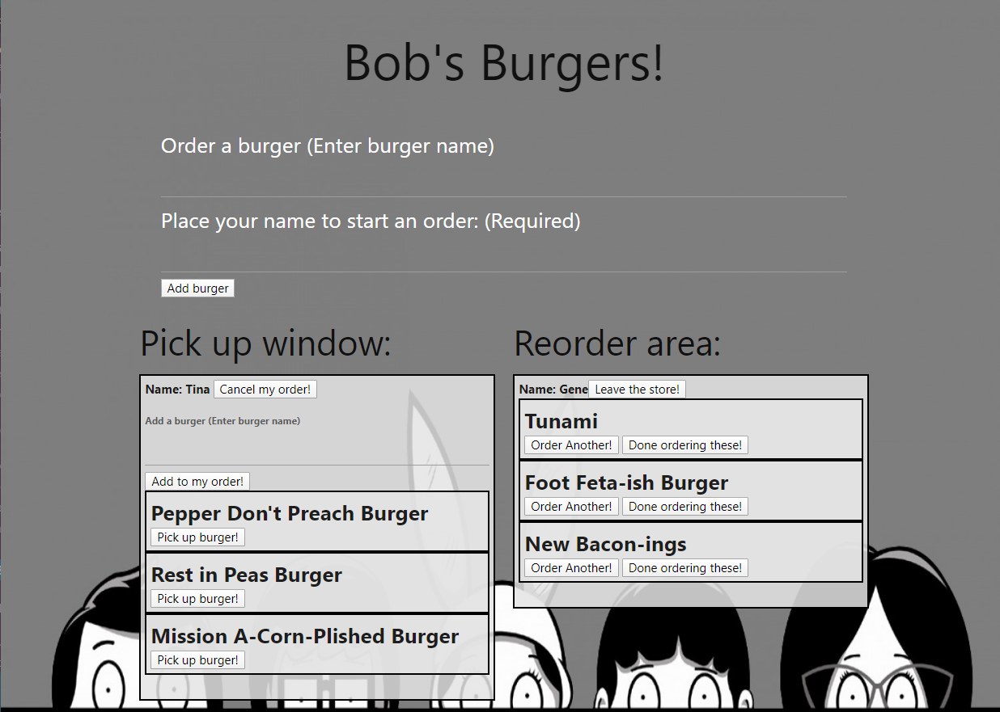

# Bob's Burgers - Sequelize Version
Welcome to Bobs Burgers! Order, pick up and reorder all the burgers you want!

__Custom ORM version GitHub link: https://github.com/MatthewBryantDonovan/burger__

__Custom ORM version Heroku link: https://mybobsburgers.herokuapp.com/__

## Order a burger 

* Buy a burger by entering the name near the top of the screen. Please enter a name for pick up!

## Pick up a burger 

* Pick up a burger by clicking it's 'Pick up order!' button within the 'Pick up window:'

## Add a burger to your order

* If you forgot to order a burger for your order, enter it in the field under your name.

## Cancel an order 

* If you placed an order by accident click on the 'Cancel my order!' button next to your name.

## Reorder a burger 

* Reorder a burger by clicking it's 'Order Another!' button within the 'Reorder area:'.

## No more burgers, PLEASE!

* If you fill up too much on a burger type, click the 'Done ordering these!' button to remove it from the 'Reorder area:'.

## Leave the store

* If you had your fill of burgers for the day click 'Leave the store!' after you have picked up all your burgers. 

